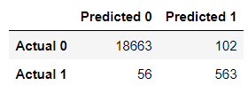
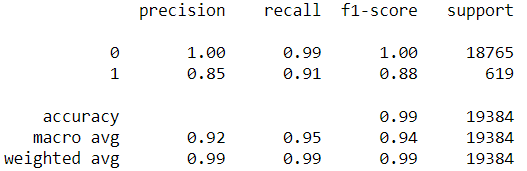
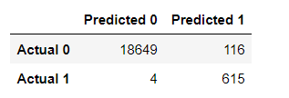
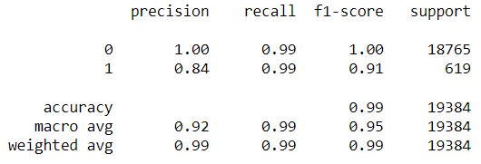

# Credit Risk Classification

## Overview of the Analysis
The purpose of the analysis is to build a model that can identify creditworthiness of borrowers and thus the potential risk in approving a loan. The dataset is based on historical lending activity from a peer-to-peer lending services company. It contains basic information including the loan amount, annual income of the borrower, total debt, debt to income ratio, and status of the loan, either healthy or high-risk. The model was designed to predict the loan status.

Building and analyzing this model required the following steps:
1. Read the file containing the data into a Pandas dataframe.
2. Identify and separate the target column and variables for the analysis. The target column (loan status) is stored in an array and the variables (all other loan information) are stored in a dataframe. It is important to note that all variables must be numerical. Any non-numerical data would need to be reviewed and assessed for encoding it into numerical data.
3. Split the data into a training and test sets. Typically, 75% of the data is in the training set, the remaining 25% in the test set.
4. Initiate the machine learning model and train the model using the training data. The Logistic Regression module from Scikit Learn was used as the machine learning model.
5. Make predictions of the loan status using the test data.
6. Evaluate the model's performance.
7. Resample the dataset and complete steps 4 through 6 to determine if this improves the model's performance. The RandomOverSampler module from Imbalanced-Learn was used for resampling.

## Results

### Machine Learning Model 1 (Logistic Regression with Original Data):
* Balanced Accuracy Score: 0.9520479254722232
* Confusion Matrix

    
* Classification Report

    

### Machine Learning Model 2 (Logistic Regression with Resampled Data):
* Balanced Accuracy Score: 0.9936781215845847
* Confusion Matrix

    
* Classification Report

    

## Summary

The first model predicts better for healthy loans (0) then high-risk loans (1) as indicated by the precision and recall in the classification report. A bank would likely be concerned with this model given 56 high-risk loans were identified as healthy loans in the confusion matrix (this resulted in a recall of 0.91 in the classification report). The precision for high-risk loans is only 0.85, but a bank would probably be less concerned about incorrectly classifying a healthy loan as high-risk. It would interesting to review those loans to see if there is any risk associated with them.

The second model fit with oversampled data predicts healthy loans at the same accuracy, recall and f1-score as the model fit with the original data. Although the precision for high-risk loans is slightly lower (0.8413 vs. 0.8466) in the second model, the recall increased from 0.9095 to 0.9935 with only 4 false positives compared with 56 with the first model. Given the potential finanical impact of incorrectly identifying a high-risk loan as healthy, the second model is much better for banks or other lending agencies to classify loans. This recommendation is further supported by higher balanced score accuracy of 0.9937 as opposed to 0.9520 further for the first model.

## Repository Contents
This repository contains the following:
1. images - Folder with images for this file.
2. resources - Folder with the csv file with loan data.
3. credit_risk_classification.ipynb - Jupyter notebook used to complete the analysis.
